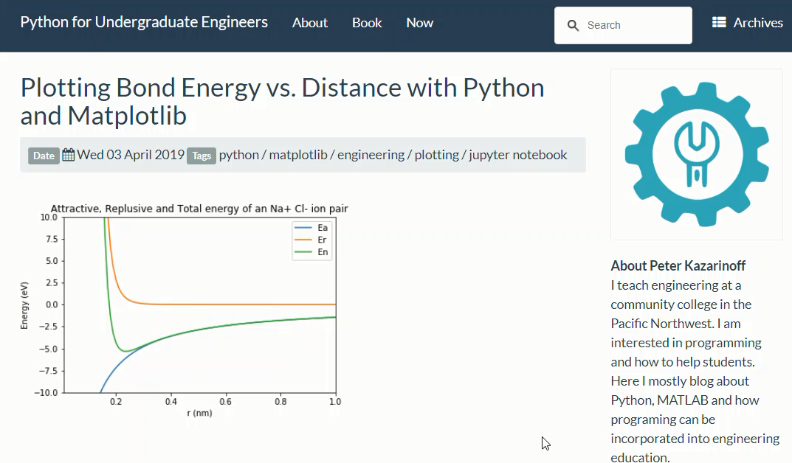

# Repo for my blog: PythonforUndergradEngineers.com

 > [https://pythonforundergradengineers.com](https://pythonforundergradengineers.com)

[](https://pythonforundergradengineers.com) 

Built with Python, [Pelican](https://docs.getpelican.com/en/stable/), and the [pelican-bootstrap3](https://github.com/getpelican/pelican-themes/tree/master/pelican-bootstrap3) theme. Deployed on [GitHub Pages](https://pages.github.com/).

## To build locally

clone the repo

 ```
$ git clone https://github.com/ProfessorKazarinoff/staticsite.git
# update all the embedded git submodules
$ git submodule update --init --recursive
```

build the conda environment and install the required packages

```
> conda create -n staticsite python=3.7]
> conda activate staticsite
(staticsite)> conda install jupyter beautifulsoup4
(staticsite)> conda install -c conda-forge pelican==4.0.1 invoke==1.2.0 ghp-import==0.5.5
(staticsite)> pip install markdown==3.1 pymdown-extensions==5.0
```

build the site and preview

```
(staticsite)> cd staticsite
(staticsite)> invoke build
(staticsite)> invoke serve
# view at localhost:8000
```

publish the site to GitHub Pages

```
(staticsite)> invoke publishsite
```
