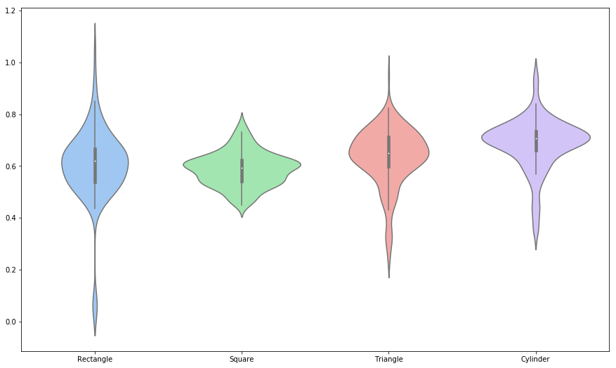

```python
import pandas as pd
import seaborn as sns
import matplotlib.pyplot as plt
```


```python
%matplotlib inline
plt.rcParams['figure.figsize'] = (15, 9)
```


```python
df = pd.read_csv('LAB_3_large_data_set_cleaned.csv')
```


```python
ax = sns.violinplot(data=df, palette="pastel")
```





```python
fig = ax.get_figure()
fig.savefig('sns_violin_plot.png', dpi=300)
```
