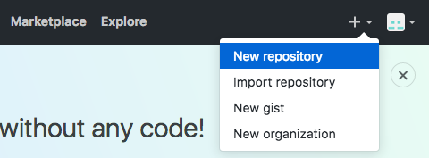

Title: How I build this site - Part 1
Date: 2017-11-22 12:40
Modified: 2017-11-22 12:40
Status: published
Category: this site
Tags: python, pelican, staticsite
Slug: how-built-site-1
Authors: Peter D. Kazarinoff
Series: How I built this site
Series_index: 1
Summary: This is the first part of a multi-part series on how I built this site. In this first post, I'll review the development environment, Python, virtual environments, installing the necessary packages and setting up git.

This is the first part of a multi-part series on how I built this site. In this first post, we'll review the development environment, installing Python, virtual environments, installing the necessary packages and setting up git.

### Setting up the development environment

What does that even mean? Before I started building this site I needed to make sure the necessary software, packages and settings were in place. This starts with setting up a _development environment_. To me, a development environment is simply the software on a computer that allows me to get work done. In this case the development environment means the tools necessary to build this site. A list of the tools and technologies are below:

1. An operating system: This website was built on machines running Windows 10, Mac OSX and Linux (Ubuntu 16.04 LTS).
2. Python: Python 3.6 (legacy Python is version 2.7)
3. Anaconda: The Anaconda Prompt and the Anaconda Python distribution
6. Github.com and git: Four different computers were used build the site. Github is the central place where the most up to date version of the site is kept. 
4. Pelican: A static site generator written in Python. Pelican will build the site from a settings file (pelicanconf.py) and posts written in markdown (.md files)
5. Markdown: the posts on this website are written in markdown, or .md format
7. fabric and make: fabric is a python package to automate builds and tasks. Fabric works on Windows. Make is used on MacOSX and Linux to build the site and serve up a demo version of the site.


### Installing Python (the Anaconda distribution)

I highly recommend installing the Anaconda distribution of Python. I have the Anaconda distribution installed on all the computers I used to build the site:

* Windows 10 Desktop at work

* Mac OSX laptop at work

* Mac OSX laptop at home

* Linux (Ubuntu 16.04 LTS) Desktop at home. 

An advantage of using the Anaconda distribution of Python is that each of these four computers will have the same stable version of Python. 

Download the lastest release at:

[https://www.anaconda.com/download](https://www.anaconda.com/download/)

The Anaconda distribution of Python comes with an up to date and stable version of Python (Python 3.6) and the **Anaconda Prompt**. The **Anaconda Prompt** is useful because it allows me to run shell commands on my Windows 10 machine at work. These are the same commands I would run in the terminal on my Mac OSX or Linux boxes. The **Anaconda Prompt** makes creating and logging into virtual environments easy and allows me to use git on Windows 10. Follow this post to [install the Anaconda on Windows 10.]({filename}installing_anaconda_on_windows.md)

 
### Create a new virtual environment

Before downloading Pelican, we should create a new virtual environment. The same virtual environment on each of the computers I use means the same packages are installed on each computer. To create a new virtual environment, open up the Anaconda Prompt (on Windows) or a terminal (on Linux or Mac OSX). Let's call our new virtual environment **_staticsite_**. The ```create``` command creates the environment and the ```-n staticsite``` flag adds the name.

```
$ conda create -n staticsite
```

This creates a new virtual environment called **_staticsite_**. Becuase I use four different computers to work on the site, I need to make sure the same Python packages are installed on each computer. Using a virtual environment ensures this consistency. Once the virtual environment **_staticsite_** is created, we need to activate it and start using it with the command:

```
$ source activate staticsite
```

We should now see ```(staticsite)``` before the terminal prompt. This means we are using the ```(staticsite)``` virtual environment.

### Install Pelican

Time for some fun! Installing Pelican. Pelican is a Python package that creates static websites. Static sites are websites that only have html, css and javascript. A static site is not connected to a database and there is no code run on the server side. The server just serves static files (html, css, javascript) to the client when the client requests them. In order to install Pelican, we need to install ```pip``` first.


```
(staticsite)$ conda install pip
```

Once ```pip``` is installed, we can install ```pelican``` and ```markdown```. These are two of the core pieces we need to build the website. ```fabric``` is also installed because we'll use it to build and demo the site on Windows.

```
(staticsite)$ pip install pelican
(staticsite)$ pip install markdown
(staticsite)$ pip install fabric
```

### Create a github account and create a new repository

While I was making the site, it became clear that I had to keep track of **_version control_**. I would make some changes to the site on my computer at work, then come home and make more changes to the site. Bringing a USB thumb drive back and forth was hard. I would forget the thumb drive at work or home and then could not edit the site. Or worse, I'd edit the site in both places and try to remember which changes were made where and which was the best version. Ah!
 
 The solution is to use **git** and **github**. Git is a command line utility that assists with version control. Using git means changes made to files on one computer can be synced with the same files on another computer. Github.com is the where the site content and settings are remotely stored and integrates easily with git. 

To sign up for a github.com account go here:

[https://github.com/join](https://github.com/join)

The account activation screen looks something like:


Once the account is set up, log in and create a new repository. Use the + button on the upper right-hand menu:



I named the new repository: **staticsite** and included both a **README.md** and a **GNU General Public License v3.0**. 


### Make a directory for the site and link it to github

Once the github repo (short for repository, basically a folder with files on github.com) is set up, the last step to complete the development environment is to link the remote repo on github to the local version of the site on my computer. 

The local version is in a folder call ```staticsite``` in the ```Documents``` folder. The ```staticsite``` folder will contain all the files used to build the site and the output files created by Pelican that _are_ the site.

```
(staticsite)$ cd ~
(staticsite)$ cd Documents
(staticsite)$ mkdir staticsite
(staticsite)$ cd staticsite
```

We can set up git to keep the contents of the local staticsite folder in sync with the contents of the staticsite repo on github.com. The command ```git init``` will initiate or create the local repository. The command ```git add origin``` followed by the url of our github repo links the folder to the repo on github. Note the web address ends in ```.git```. If you are following along and want to build your own static site, make sure to change ```username``` to your github username and ```reponame``` to your github repo name.

```
git init
git remote add origin https://github.com/username/reponame.git
```

Now for the git magic. On github.com we have a README.md file and a licence. But the local staticsite folder on the computer is empty. So the two folders aren't in sync. To make the contents of each folder identical, we **_pull_** the files from github onto the local computer. A **_pull_** "pulls" or gets the files from github and copies them to the local staticsite folder.

```
(staticsite)$ git pull origin master
```

If you look in the local staticsite folder you should now see the following two files:

```
staticsite
├── LICENSE
├── README.md
```

The development environment is set! On to building the site!

Now each time I work on the site, I navigate to the **staticsite** folder on whatever computer I am using. Before any editing, I key in the command:

```
git pull origin master
```

The after the _pull_ the staticsite folder is up to date with the newest version of all the files on github. Then I go about editing files, writing posts, changing settings, etc. After the edits, the last thing I type before shutting down the computer for the day is:

```
git push origin master
```

This ensures all of my computers and the github repo contain the same version of the site.