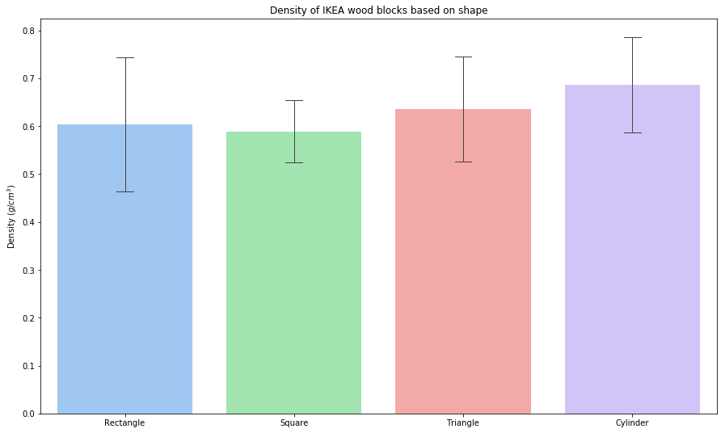

Title: Bar chart with error bars using seaborn, matplotlib, and python
Date: 2017-10-12
Author: Peter D. Kazarinoff

Title: Four different statistics charts using Python, matplotlib and seaborn
Date: 2017-10-19 10:39
Modified: 2017-10-19 10:39
Status:
Category: matplotlib
Tags: python, matplotlib, engineering, statistics, seaborn, pandas
Slug: seaborn-bar-chart
Authors: Peter Kazarinoff
Summary: In this post we will create a bar chart using python, pandas, matplot lib and seaborn. Then style the chart with custom colors, error bars, axis label and title.  

First we will import the three packages used to make the plot. Pandas is used to import the data and put it in a pandas dataframe. A pandas dataframe is an object type that works well for building plots. It stores data in rows and columns like an excel file. We'll use matplotlib to dipay the chart. The last import, seaborn will be used to construct the plot. Seaborn will output a matplotlib axis object. Therefore can use standard matplotlib methods to modify the seaborn plot


```python
# seaborn bar chart

import pandas as pd
import matplotlib.pyplot as plt
import seaborn as sns
```


```python
%matplotlib inline
plt.rcParams['figure.figsize'] = (15, 9)
```

Now we need to import the data. The data in the .csv file represents the density of wood blocks from IKEA. The blocks are either rectangle, square, triangle or cylinder in shape. There is a column for each shape. The data points are density measurements in g/cm3. We use pandas read_csv() function to read the data and put it in a dataframe. df is a common pandas datafram varible name. Seaborn can't plot .csv files directly, but it can plot pandas dataframes. 


```python
df = pd.read_csv('LAB_3_large_data_set_cleaned.csv')
```


```python
df
```


<div>
<style>
    .dataframe thead tr:only-child th {
        text-align: right;
    }

    .dataframe thead th {
        text-align: left;
    }

    .dataframe tbody tr th {
        vertical-align: top;
    }
</style>
<table border="1" class="dataframe">
  <thead>
    <tr style="text-align: right;">
      <th></th>
      <th>Rectangle</th>
      <th>Square</th>
      <th>Triangle</th>
      <th>Cylinder</th>
    </tr>
  </thead>
  <tbody>
    <tr>
      <th>0</th>
      <td>0.560</td>
      <td>0.760</td>
      <td>0.244</td>
      <td>0.943</td>
    </tr>
    <tr>
      <th>1</th>
      <td>0.822</td>
      <td>0.760</td>
      <td>0.252</td>
      <td>0.943</td>
    </tr>
    <tr>
      <th>2</th>
      <td>0.628</td>
      <td>0.750</td>
      <td>0.299</td>
      <td>0.932</td>
    </tr>
    <tr>
      <th>3</th>
      <td>0.557</td>
      <td>0.730</td>
      <td>0.308</td>
      <td>0.910</td>
    </tr>
    <tr>
      <th>4</th>
      <td>0.516</td>
      <td>0.730</td>
      <td>0.323</td>
      <td>0.860</td>
    </tr>
    <tr>
      <th>5</th>
      <td>0.736</td>
      <td>0.726</td>
      <td>0.326</td>
      <td>0.839</td>
    </tr>
    <tr>
      <th>6</th>
      <td>0.561</td>
      <td>0.717</td>
      <td>0.327</td>
      <td>0.825</td>
    </tr>
    <tr>
      <th>7</th>
      <td>0.646</td>
      <td>0.717</td>
      <td>0.332</td>
      <td>0.817</td>
    </tr>
    <tr>
      <th>8</th>
      <td>0.510</td>
      <td>0.713</td>
      <td>0.338</td>
      <td>0.804</td>
    </tr>
    <tr>
      <th>9</th>
      <td>0.900</td>
      <td>0.704</td>
      <td>0.365</td>
      <td>0.804</td>
    </tr>
    <tr>
      <th>10</th>
      <td>0.610</td>
      <td>0.700</td>
      <td>0.405</td>
      <td>0.795</td>
    </tr>
    <tr>
      <th>11</th>
      <td>0.650</td>
      <td>0.695</td>
      <td>0.412</td>
      <td>0.790</td>
    </tr>
    <tr>
      <th>12</th>
      <td>0.625</td>
      <td>0.691</td>
      <td>0.430</td>
      <td>0.786</td>
    </tr>
    <tr>
      <th>13</th>
      <td>0.665</td>
      <td>0.690</td>
      <td>0.435</td>
      <td>0.779</td>
    </tr>
    <tr>
      <th>14</th>
      <td>1.045</td>
      <td>0.689</td>
      <td>0.454</td>
      <td>0.779</td>
    </tr>
    <tr>
      <th>15</th>
      <td>0.437</td>
      <td>0.680</td>
      <td>0.456</td>
      <td>0.777</td>
    </tr>
    <tr>
      <th>16</th>
      <td>0.538</td>
      <td>0.677</td>
      <td>0.460</td>
      <td>0.777</td>
    </tr>
    <tr>
      <th>17</th>
      <td>0.762</td>
      <td>0.672</td>
      <td>0.467</td>
      <td>0.776</td>
    </tr>
    <tr>
      <th>18</th>
      <td>0.560</td>
      <td>0.672</td>
      <td>0.471</td>
      <td>0.776</td>
    </tr>
    <tr>
      <th>19</th>
      <td>0.596</td>
      <td>0.670</td>
      <td>0.480</td>
      <td>0.770</td>
    </tr>
    <tr>
      <th>20</th>
      <td>0.583</td>
      <td>0.665</td>
      <td>0.484</td>
      <td>0.768</td>
    </tr>
    <tr>
      <th>21</th>
      <td>0.640</td>
      <td>0.661</td>
      <td>0.484</td>
      <td>0.767</td>
    </tr>
    <tr>
      <th>22</th>
      <td>0.666</td>
      <td>0.661</td>
      <td>0.485</td>
      <td>0.767</td>
    </tr>
    <tr>
      <th>23</th>
      <td>0.769</td>
      <td>0.660</td>
      <td>0.486</td>
      <td>0.765</td>
    </tr>
    <tr>
      <th>24</th>
      <td>0.532</td>
      <td>0.660</td>
      <td>0.491</td>
      <td>0.762</td>
    </tr>
    <tr>
      <th>25</th>
      <td>0.457</td>
      <td>0.654</td>
      <td>0.491</td>
      <td>0.762</td>
    </tr>
    <tr>
      <th>26</th>
      <td>0.648</td>
      <td>0.650</td>
      <td>0.495</td>
      <td>0.761</td>
    </tr>
    <tr>
      <th>27</th>
      <td>0.616</td>
      <td>0.650</td>
      <td>0.497</td>
      <td>0.761</td>
    </tr>
    <tr>
      <th>28</th>
      <td>0.768</td>
      <td>0.649</td>
      <td>0.497</td>
      <td>0.753</td>
    </tr>
    <tr>
      <th>29</th>
      <td>0.440</td>
      <td>0.648</td>
      <td>0.499</td>
      <td>0.753</td>
    </tr>
    <tr>
      <th>...</th>
      <td>...</td>
      <td>...</td>
      <td>...</td>
      <td>...</td>
    </tr>
    <tr>
      <th>203</th>
      <td>NaN</td>
      <td>NaN</td>
      <td>0.745</td>
      <td>NaN</td>
    </tr>
    <tr>
      <th>204</th>
      <td>NaN</td>
      <td>NaN</td>
      <td>0.748</td>
      <td>NaN</td>
    </tr>
    <tr>
      <th>205</th>
      <td>NaN</td>
      <td>NaN</td>
      <td>0.748</td>
      <td>NaN</td>
    </tr>
    <tr>
      <th>206</th>
      <td>NaN</td>
      <td>NaN</td>
      <td>0.750</td>
      <td>NaN</td>
    </tr>
    <tr>
      <th>207</th>
      <td>NaN</td>
      <td>NaN</td>
      <td>0.750</td>
      <td>NaN</td>
    </tr>
    <tr>
      <th>208</th>
      <td>NaN</td>
      <td>NaN</td>
      <td>0.750</td>
      <td>NaN</td>
    </tr>
    <tr>
      <th>209</th>
      <td>NaN</td>
      <td>NaN</td>
      <td>0.751</td>
      <td>NaN</td>
    </tr>
    <tr>
      <th>210</th>
      <td>NaN</td>
      <td>NaN</td>
      <td>0.752</td>
      <td>NaN</td>
    </tr>
    <tr>
      <th>211</th>
      <td>NaN</td>
      <td>NaN</td>
      <td>0.752</td>
      <td>NaN</td>
    </tr>
    <tr>
      <th>212</th>
      <td>NaN</td>
      <td>NaN</td>
      <td>0.752</td>
      <td>NaN</td>
    </tr>
    <tr>
      <th>213</th>
      <td>NaN</td>
      <td>NaN</td>
      <td>0.752</td>
      <td>NaN</td>
    </tr>
    <tr>
      <th>214</th>
      <td>NaN</td>
      <td>NaN</td>
      <td>0.763</td>
      <td>NaN</td>
    </tr>
    <tr>
      <th>215</th>
      <td>NaN</td>
      <td>NaN</td>
      <td>0.770</td>
      <td>NaN</td>
    </tr>
    <tr>
      <th>216</th>
      <td>NaN</td>
      <td>NaN</td>
      <td>0.771</td>
      <td>NaN</td>
    </tr>
    <tr>
      <th>217</th>
      <td>NaN</td>
      <td>NaN</td>
      <td>0.771</td>
      <td>NaN</td>
    </tr>
    <tr>
      <th>218</th>
      <td>NaN</td>
      <td>NaN</td>
      <td>0.775</td>
      <td>NaN</td>
    </tr>
    <tr>
      <th>219</th>
      <td>NaN</td>
      <td>NaN</td>
      <td>0.778</td>
      <td>NaN</td>
    </tr>
    <tr>
      <th>220</th>
      <td>NaN</td>
      <td>NaN</td>
      <td>0.780</td>
      <td>NaN</td>
    </tr>
    <tr>
      <th>221</th>
      <td>NaN</td>
      <td>NaN</td>
      <td>0.780</td>
      <td>NaN</td>
    </tr>
    <tr>
      <th>222</th>
      <td>NaN</td>
      <td>NaN</td>
      <td>0.780</td>
      <td>NaN</td>
    </tr>
    <tr>
      <th>223</th>
      <td>NaN</td>
      <td>NaN</td>
      <td>0.781</td>
      <td>NaN</td>
    </tr>
    <tr>
      <th>224</th>
      <td>NaN</td>
      <td>NaN</td>
      <td>0.782</td>
      <td>NaN</td>
    </tr>
    <tr>
      <th>225</th>
      <td>NaN</td>
      <td>NaN</td>
      <td>0.784</td>
      <td>NaN</td>
    </tr>
    <tr>
      <th>226</th>
      <td>NaN</td>
      <td>NaN</td>
      <td>0.784</td>
      <td>NaN</td>
    </tr>
    <tr>
      <th>227</th>
      <td>NaN</td>
      <td>NaN</td>
      <td>0.806</td>
      <td>NaN</td>
    </tr>
    <tr>
      <th>228</th>
      <td>NaN</td>
      <td>NaN</td>
      <td>0.807</td>
      <td>NaN</td>
    </tr>
    <tr>
      <th>229</th>
      <td>NaN</td>
      <td>NaN</td>
      <td>0.813</td>
      <td>NaN</td>
    </tr>
    <tr>
      <th>230</th>
      <td>NaN</td>
      <td>NaN</td>
      <td>0.816</td>
      <td>NaN</td>
    </tr>
    <tr>
      <th>231</th>
      <td>NaN</td>
      <td>NaN</td>
      <td>0.823</td>
      <td>NaN</td>
    </tr>
    <tr>
      <th>232</th>
      <td>NaN</td>
      <td>NaN</td>
      <td>0.952</td>
      <td>NaN</td>
    </tr>
  </tbody>
</table>
<p>233 rows × 4 columns</p>
</div>


Time to build the plot. We will call seaborns sns.barplot() function to create a nice-looking plot with error bars already included. The arguments within the function are the data=df, this tells seaborn which dataset to plot. We don't need to do any further manipulation of our dataframe becuase the data is already in columns with the dataframe column headers corresponding to the block shape. The second argument palette="pastel" will color our bars a nice pastel group of colors. You could also try palette="muted", palette="PRGn" or palette="Set3". Seaborn has many different built-in pallet types.


```python
sns.barplot(data=df, palette="pastel")
```


    <matplotlib.axes._subplots.AxesSubplot at 0x1a0fe7b9b0>


Now we can do a little more plot customization. First thing we are going to customize is the error bars. Seaborns sns.barplot() function will build a plot with the standard seaborn confidence interval as the length of the error bars. From my point of view, this gives a warped sense of confidence in the data. Instead of seaborns default confidence interval as the error bar length, let's use the standard deviation instead. The ci="sd" argument will set the confidence interval(ci) to the standard deviation(sd). We are also going style the error bars. I like caps on top of error bars. I think it makes it easier to see across and compare bar and error bar height. We'll add error bar caps with the errwidth=1 and capsize=0.1 arguments. errwidth is the line width of the error bars. Setting erridth to 1 will style the error bars to look like the line thickness in the rest of the plot. capsize=0.1 will set the error bar cap size to a good width. You can play around with different capsizes, but I like 0.1 for this plot.


```python
sns.barplot(data=df, palette="pastel" ,ci='sd', errwidth=1, capsize=0.1)
plt.show()
```


Next we are going to add some labels to the bar plot. We need to add an x-axis label which shows density and the units g/cm3. We are also going to add a title. Seabrons sns.barplot() function outputs standard matplotlib axis objects. If we assign the plot to an axis object variable (ax is a typical varaible name), we can then modify that axis using standard matplotlib methods. We'll use the ax.set_ylabel() method to add the y-axis label, and ax.set_title() to add a title to the plot.


```python
ax = sns.barplot(data=df, palette="pastel" ,ci='sd', errwidth=1, capsize=0.1)
ax.set_ylabel('Density (g/cm3)')
ax.set_title('Density of IKEA wood blocks based on shape')
plt.show()
```


Now the y-axis is included on the plot, but it still looks a little funny. The units g/cm3 don't have the cubed (3) as a super script like it should be. Matplotlib allows LaTeX formatting in text. We'll use LaTeX formatting to make the cubed (3) a super script. To call LaTeX formating we surround the LaTeX expression in dollar signs ($). In LaTeX putting a number in superscript is done with the carrot character (^). 


```python
ax = sns.barplot(data=df, palette="pastel" ,ci='sd', errwidth=1, capsize=0.1)
ax.set_ylabel('Density ($g/cm^3$)')
ax.set_title('Density of IKEA wood blocks based on shape')
plt.show()
```


Our final plot looks great! We created a bar chart with seabron and modified some of the plot elements. We took advantage of seaborn plots being matplotlib axis objects which allowed us to modify the plot further. We even added some fancy LaTeX to style a super script. The full code is below. 


```python
# seaborn bar chart

import pandas as pd
import matplotlib.pyplot as plt
import seaborn as sns

%matplotlib inline
plt.rcParams['figure.figsize'] = (15, 9)

df = pd.read_csv('LAB_3_large_data_set_cleaned.csv')

ax = sns.barplot(data=df, palette="pastel" ,ci='sd', errwidth=1, capsize=0.1)
ax.set_ylabel('Density ($g/cm^3$)')
ax.set_title('Density of IKEA wood blocks based on shape')

plt.show()
```




